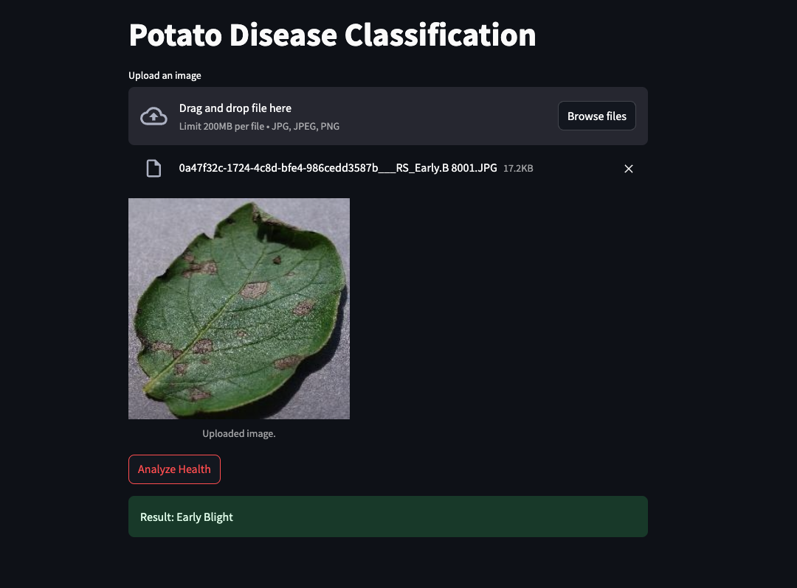
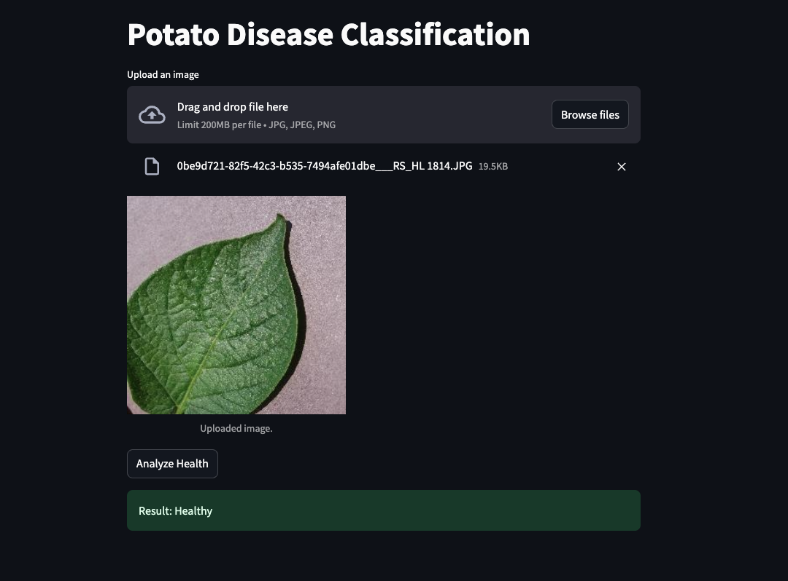
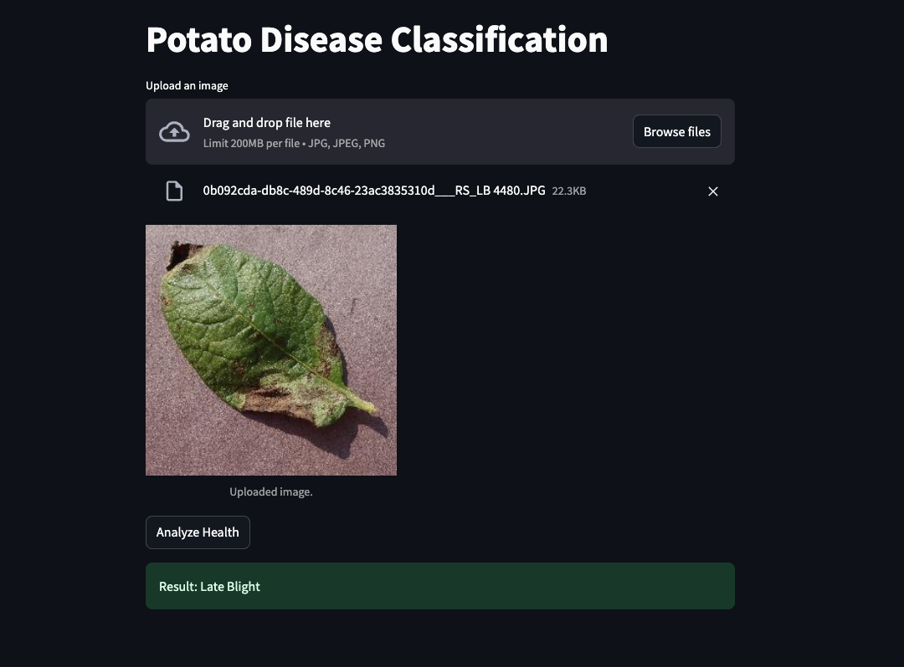

# **LeafGuard** 🌿  
**Leaf Disease Classification using FastAPI and Streamlit**  

## **Overview**  
**LeafGuard** is a machine learning application designed to analyze and classify the health based on images. It combines **FastAPI** to serve the machine learning model and **Streamlit** to provide an interactive user interface.  

---
### **Screenshot** 🖼️  
Below is an example of the Streamlit interface:  




---


## **Features** ✨  
- **Image Upload:** Upload leaf images directly through the web interface.  
- **Disease Classification:** Detects diseases in potato leaves.  
- **Simple Interface:** Interactive web interface for easy usage.  
- **Flexible APIs:** REST endpoints built with FastAPI.  
- **Scalable and Modular:** Organized code for easy maintenance and future improvements.  

---

## **Technologies Used** 🛠️  
- **Python** - Main programming language.  
- **FastAPI** - Backend framework to serve the machine learning model.  
- **Streamlit** - Interactive web interface for image upload and results display.  
- **TensorFlow/Keras** - Framework used for training and inference.  
- **Pillow** - Image processing library.  
- **Uvicorn** - ASGI server to run the FastAPI application.  

---

## **Project Structure** 📁  

```plaintext
LeafSense/
├── api/                        # FastAPI code
│   ├── main.py                 # Main API endpoint
│   ├── models.py               # Model logic
│   ├── utils.py                # Helper functions
├── streamlit_app/              # Streamlit code
│   ├── app.py                  # Web interface
├── training/                   # Training data
│   ├── PlantVillage/           # Dataset used for training
├── models/                     # Saved trained models
├── venv/                       # Virtual environment
├── requirements.txt            # Project dependencies
├── README.md                   # Project documentation
```

## **Setup and Installation** 🖥️  

### **1. Clone the repository**  
```bash
git clone https://github.com/user/LeafSense.git
cd LeafSense

```

### **2. Create a virtual environment**  
```bash
python3 -m venv venv
source venv/bin/activate   # Linux/MacOS
venv\Scripts\activate      # Windows
```

### **3. Install dependencies**  
```bash
pip install -r requirements.txt

Link Kaggle: https://www.kaggle.com/datasets/arjuntejaswi/plant-village
```

---

## **Running the Project** 🚀  

### **1. Start the FastAPI Server**  
```bash
uvicorn api.main:app --reload
```
- **API Documentation:** [http://localhost:8000/docs](http://localhost:8000/docs)  

### **2. Start the Streamlit App**  
```bash
streamlit run streamlit_app/app.py
```
- **Web Interface:** [http://localhost:8501](http://localhost:8501)  

---

## **Example Usage** 🖼️  
1. Open the web application in your browser.  
2. Upload a potato leaf image.  
3. Click the "Analyze Health" button.  
4. View the result indicating the condition of the leaf.  

---

## **API Endpoint** 🌐  

**POST** `/predict`  
- **Request:** Upload an image file.  
- **Response:**  
  ```json
  {
      "class": "Healthy"
  }
  ```

---

## **Contributing** 🤝  
Contributions are welcome! Follow these steps:  
1. **Fork** the repository.  
2. Create a new branch:  
   ```bash
   git checkout -b feature/new-feature
   ```
3. Commit your changes:  
   ```bash
   git commit -m "Add new feature"
   ```
4. Push to the branch:  
   ```bash
   git push origin feature/new-feature
   ```
5. Open a **Pull Request**.  

